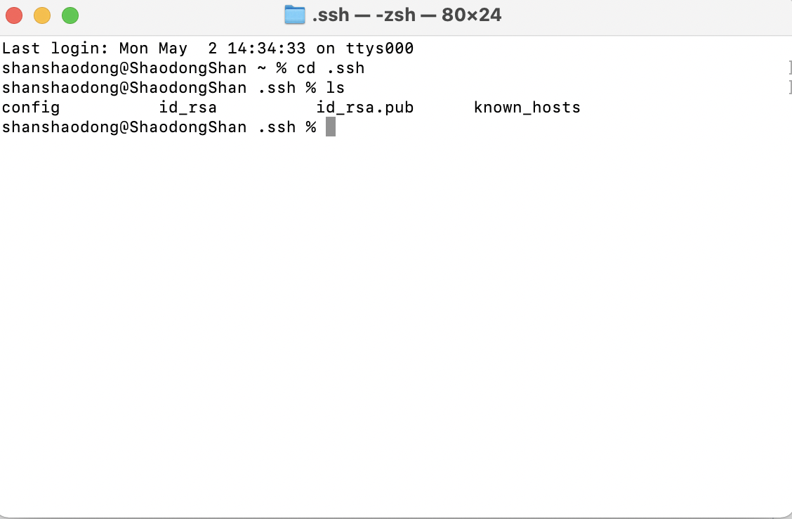
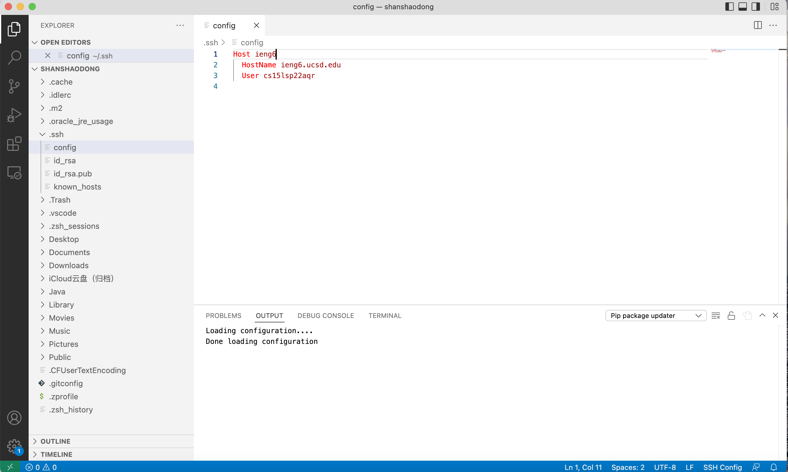
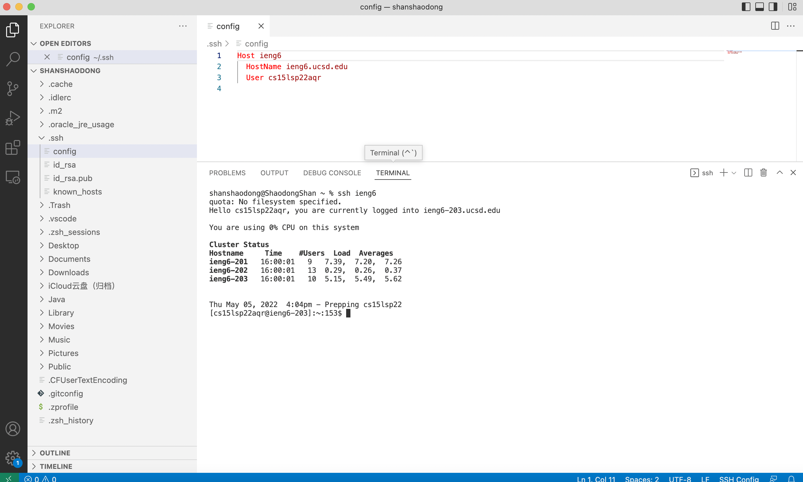
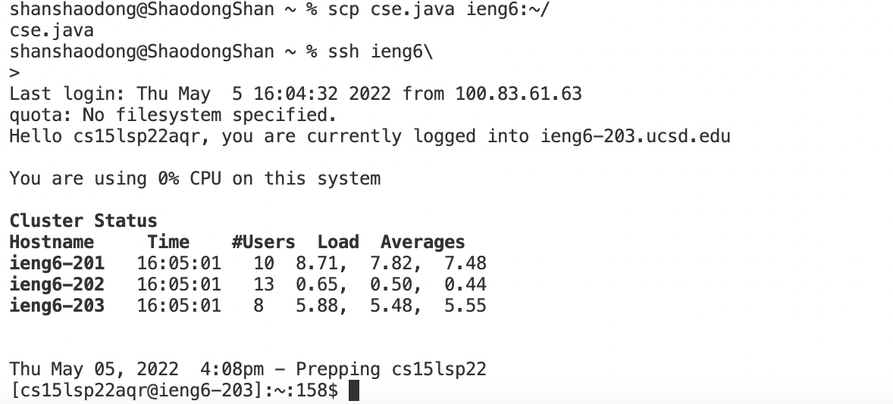

# Name : Shaodong Shan
# Course: CSE 15L Lab3
>Date: May 05, 2022
>
>This is my third lab report, welcome.
>

>
>
# 1. Show .ssh/config file, and how to edited it
First step we need to Show the .ssh/config file
We open the terminal and use the following command
* cd ./.ssh
* ls

>The above commands will help us to check that weather exist a config file or not.
>
>If not, we can use another command "touch config" to create a config file.
>

>After above steps, we can find the config file in our VScode.
>

>
>Adding to ssh config file, the file that:
>Host ieng6
>    HostName ieng6.ucsd.edu
>    User cs15lsp22aqr

# 2. Show the ssh command logging into our account using just the alias we chosen.
>The command we use is "ssh ieng6"

# 3. Show an scp command copying a file to our account using just the alias we chosen.
>I create a java file in my VScode and named it cse.java
>Then I can use the command "scp cse.java ieng6:~/" to scp my cse.java file into the server.

# Thank you
>This is the end of my lab report 3. Thanks for your watching.
  

